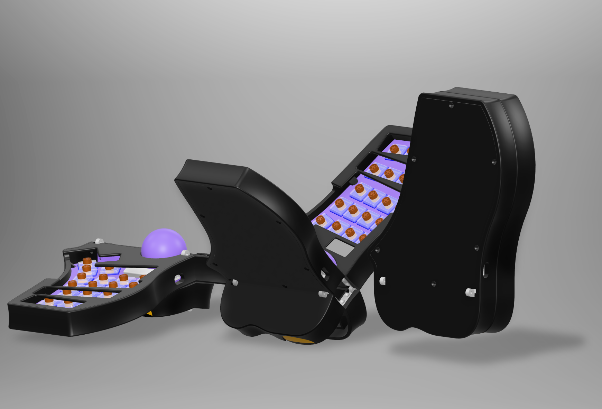

# Androphage

There have been keyboards that are portable and there have been keyboards that
have integrated pointing devices, but to date there haven't been any keyboards
that combine both features. With this new design I intend to change that.

I'm reaching the end of the design phase on my new keyboard, Androphage. It's a
folding unibody split keyboard with 44 keys and a finger trackball in the
center. When the keyboard is closed, all the more delicate components ---
switches, keycaps, screen --- are protected inside the rugged SLS nylon case.
Additionally the trackball is secured in-place by the folding base of the
keyboard.

## Highlights:

- Unibody with fixed 15° split angle\* and 10° tent angle.

- 44 keys: 3x5, plus 4 thumb keys, row 5\*\* middle and ring finger keys, and
  key that can either be a very tucked thumb key or a row 5 index finger key.

- Rugged SLS nylon case.

- NRF52850 microcontroller and ZMK firmware for Bluetooth, dongle, or wired
  connectivity.

- Dual-sensor 34mm trackball is capable of 3-axis control, i.e. twist-to-scroll
  à la Kensington SlimBlade.

- Nice!View or similar screen for layer, pairing, and charging status.

- Low power consumption microcontroller and trackball sensors (PMW3610) paired
  with a 300 mAh LiPo battery for days or weeks of battery life.

- USB-C charging and connectivity.

- Designed for Chicago Steno or KLP Lamé keycaps but can potentially be adapted
  for other low-to-mid-profile keycaps.

- The custom hinges are SLM stainless steel for maximum durability.

- There is space inside the base for storing the charging cable.

- Unfolded dimensions: 290 x 135 x 62 mm

- Folded dimensions: 148 x 135 x 45 mm

\* Measured between the centerline of the keyboard and the axis of the index
finger key column.

\*\* That is, two rows below the home row, equivalent to the modifier row on an
ANSI/ISO keyboard.

## Additional Renders

## Open Source

This project is licensed under the CERN Open Hardware License, Strongly
Reciprocal 2.0.

> *Well, I saw the thing comin' out of the sky*
>
> *It had a-one long horn and one big eye*
>
> *I commenced to shakin' and I said, "Ooh-eee!*
>
> *It looks like a purple people eater to me!"*
>
> &mdash;Sheb Wooley